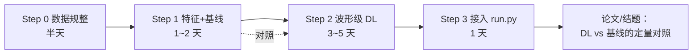

# phmdc —— PHM2019 铝搭接件（外部方法验证平台）

> **本目录是什么**：PHM Society 2019 数据挑战赛数据集
> *Fatigue Crack Growth in Aluminum Lap-Joint* 的本地副本，以及基于它的
> **分析方案**。它是本项目第 4 套数据（暂称**数据集 D**），定位是
> **"有定量真值的方法验证平台"** —— 不替代 A/B/C，只用来把方法跑通、跑扎实。
>
> 数据来源与引用见 §7。**Step 0 / Step 1 / Step 2 与 T7–T8 外推评测均已实现并跑通**
> （2026-09-20 ~ 09-21，见 §5.0 / §5.1 / §5.2 / §5.2b，含 **8 项核对**与实测修正）；
> **仅「接入 `run.py`」未做**。

---

## 0. 为什么引入这份数据

本项目现有三套数据（A 主样本 / B L1 一批 / C L1 二批）有一个共同的硬伤：

> **没有损伤定量真值。** A 只有"失效锚"（数据末端 / b3），B/C 只有实测 `n_f`，
> 定位的"准确性"因**无 NDT 成像**而**永久不可评估**（见主 `README.md` §5.7）。

phmdc 补上的正是这一块：**每个测量时刻都有光学显微镜实测的裂纹长度（mm）**。
它让我们第一次可以回答"这个损伤指标对不对"，而不只是"它单调不单调"。

**同时必须说清代价**（详见 §4）：phmdc 是**铝、铆接、Lamb 波**，
B/C 是**复材、加筋、声发射** —— **物理上不可迁移**。
因此本平台的结论只能宣称「**方法有效**」，**不能**宣称「可迁移到复材加筋板」。

---

## 1. 数据结构（实测清点）

```
phmdc/
├── ReadMe.docx                 官方说明（测试描述 + 数据格式）
├── T1/ … T8/                   8 个试件（T1–T6 训练、T7–T8 验证）
│   ├── Description_T*.xlsx     该试件的裂纹扩展记录（**真值**）
│   ├── Constant Loading Profile-5 cycles.csv   等幅载荷时序（T1–T7）
│   ├── Variable Loading Profile-1 block-1000 cycles.csv   变幅载荷（T8）
│   └── <cycle>/                以循环数命名的测量时刻
│       ├── signal_1.csv        第 1 次重复测量
│       └── signal_2.csv        第 2 次重复测量
```

| 试件 | 测量时刻数 | 循环数 | 载荷 |
| --- | ---: | --- | --- |
| T1 | 7 | 50000, 60000, 62500, 65500, 69025, 70026, 70766 | 等幅 |
| T2 | 3 | 50000, 70033, 72000 | 等幅 |
| T3 | 10 | 14000, 50000, 55391, 57038, 60035, 62017, 64019, 65029, 66012, 66510 | 等幅 |
| T4 | 8 | 55900 … 75045 | 等幅 |
| T5 | 4 | 42000, 46000, 51000, 56000 | 等幅 |
| T6 | 6 | 55000 … 73211 | 等幅 |
| T7 | 4 | 36001, 40167, 44054, 47022 | 等幅 |
| T8 | 5 | 40000, 50000, 70000, 74883, 76931 | **变幅** |
| **合计** | **47** | — | — |

⇒ **47 个时刻 × 2 次重复 = 94 个波形文件**。

### 1.1 波形格式（实测）

| 项 | 值 |
| --- | --- |
| 行数 | **4000** 点/文件 |
| 采样间隔 | `dt = 5.0×10⁻⁸ s` ⇒ **fs = 20 MHz** |
| 时长 | 0 → 1.99952×10⁻⁴ s（**约 200 µs**） |
| 列 | `time` [s]、`ch1` **激励信号** [V]、`ch2` **接收信号** [V] |
| 幅值 | `ch1` 峰峰值 **1.92 ~ 4.24 V**（**逐试件不同**）；`ch2` 峰峰值 **0.20 ~ 0.51 V** |

> ⚠️ `ch1` 逐试件不同 ⇒ **绝对幅值不可跨试件比较**，
> 必须先做**传递函数归一** $H(f)=\mathrm{FFT}(ch_2)/\mathrm{FFT}(ch_1)$（见 §5 Step 1）。

### 1.2 试件与传感配置（据 `ReadMe.docx`）

- **2024-T3 航空级铝板**，厚 **1.6 mm**，两块板由 **3 排铆钉 × 5 颗**铆接。
- **PZT 压电片**：作动器 **1–5 号**、传感器 **6–10 号**，**pitch-catch** 一发一收。
- 裂纹**从第一排沉头孔起裂**，串联各孔后断裂 ⇒ 只检查第一排沉头孔。
- **只提供"观测到裂纹的那一对"传感器信号**，其余传感器对**已从数据集中剔除**
  ⇒ 本数据**不含多通道信息，无法做定位**。
- 载荷：液压疲劳机 **5 Hz**，室温；**T1–T7 等幅，T8 变幅**。
  实测幅值（千牛，载荷谱文件 `*Loading Profile*.csv`，见 §5.2b.5）：
  **T1–T7 = 95.44 kN（7 个文件内容完全相同）**；
  **T8 = 两级块谱 500 循环 @ 85.23 + 500 循环 @ 95.44 / 块**（均值 90.34）。
  ⇒ T8 与 T1–T7 的幅值**只差 5.3%**。

---

## 2. 三个必须先知道的事实

### ① 🔴 T7 / T8 **带完整真值** —— 与官方说明不一致

官方描述写"验证集不含真值"，但本副本的 `Description_T7.xlsx` / `Description_T8.xlsx`
**包含超出波形时刻范围的完整裂纹扩展记录**：

| 组 | 给了波形的时刻 | 真值覆盖到 |
| --- | --- | --- |
| T7 | 36001 / 40167 / 44054 / 47022（**4 个**） | **55031** |
| T8 | 40000 / 50000 / 70000 / 74883 / 76931（**5 个**） | **100774** |

⇒ 两个结论：
1. **8 个试件全都有标签**（不是"6 个有、2 个没有"）；
2. T7/T8 天然构成 **"外推 / 预后"评测**：波形只给前半段、真值给到后半段 ——
   这正是本项目一直想做但**在 A/B/C 上做不到**的 RUL 检验。

### ② 🔴 缺 `Baseline`（cycle = 0）文件夹

`ReadMe.docx` 说明每组应有 `Baseline`（疲劳测试**之前**采集的健康参照），
但本副本 **8 组都没有**。
**影响可控**：T3/T5/T6/T7/T8 都有早期"裂纹 = 0"的时刻，可替代健康参照。

> Step 0 补充：**T6 的 xlsx 里仍保留一条 `cycle = 0` 的标签行**（裂纹 0 mm），
> 但**没有对应的波形目录** ⇒ 这正是 Baseline 被删剩的痕迹，
> 也说明"标签表"与"波形目录"是两套独立清单（对账时须允许"有标签无波形"）。

### ③ ⚠️ 一处标签缺口 + 一处录入错字 + 一个解析陷阱

> 以下三条均经 Step 0 全量核对后**修正**（原始说法见 `docs`/git 历史）。

- **T3 的 55391** 确实**没有**对应标签（波形有、真值缺 1 条）。
- **T4 的 67054 有标签**，但在 xlsx 里被**录成 `7054`**（丢了首位数字）。
  依据：`str(67054).endswith('7054')` 且两边差集**唯一配对**；
  另旁证——修正后 T4 的 8 个循环数
  `55900/60200/65001/67054/70016/71130/73210/75045` 与裂纹长度
  `0/1.61/2.17/2.74/3.13/4.06/4.96/7.24` **同时严格单调**。
  ⇒ 已在 `labels.csv` 的 `note` 列留痕（保留 `cycle_raw` 原值），**不静默改数**。
- **`Description_T*.xlsx` 各试件的表头行位置并不一致**（T1–T7 的
  `Specimen NO.` 在第 2 行，**T8 在第 2–3 行且标题行缺 `Table 1.` 后缀**）。
  ⇒ 必须**扫描定位**含 `cycle` 与 `Crack` 的表头行，**不能按行号猜**（`step0.py` 已如此实现）。
- 📌 **更正**：此前记录的"表头附传感器编号表（形如 `1/4/9`）"在本副本中**不存在** ——
  8 个 xlsx 的 `Sheet2`/`Sheet3` **全为空**（`A1:A1`，0 个非空单元格）。
  真正会误当数据行的是 **T8 那种错位的 Table 1 行**。

### 2.1 已确认可用的真值样例（Step 0 对账基准）

以下三组是我逐行读出来的，可直接作为 Step 0 的**对账基准**：

| 试件 | 循环数 → 裂纹长度（mm） |
| --- | --- |
| **T1** | 50000→0 · 60000→2.18 · 62500→2.76 · 65500→3.51 · 69025→4.51 · 70026→4.90 · 70766→**7.46** |
| **T7** | 36001→0 · 40167→0 · 44054→2.07 · 47022→3.14 · 49026→3.56 · 51030→4.13 · 53019→5.05 · 55031→**7.22** |
| **T8** | 40000→0 · 50000→0 · 70000→0 · 74883→1.94 · 76931→2.50 · 89237→3.71 · 92315→3.88 · 96475→4.61 · 98492→4.96 · 100774→**5.52** |

> T2 / T4 / T5 / T6 的标签**已确认存在**，但具体条目未逐行核对 ⇒ Step 0 全量核对。

---

## 3. 与现有数据集的对照

| 维度 | **A 主样本** | **B/C（ReMAP L1）** | **phmdc（数据集 D）** |
| --- | --- | --- | --- |
| 材料 / 结构 | 内部疲劳机试样 | **复材加筋板** | **铝，铆接搭接件** |
| 传感 | FO + AE + 应变 | FBG / DFOS + AE | **PZT Lamb 波（pitch-catch）** |
| 原始波形 | ❌ 供应商只给特征 | ❌ `.pridb` **未开 TR**（实测） | ✅ **20 MHz / 4000 点** |
| 损伤定量真值 | ❌（只有失效锚） | ❌（只有 `n_f`） | ✅ **裂纹长度 mm** |
| 试件数 | 5 | 4 / 9 | **8** |
| 时间锚 | 10 Hz 统一轴 | 一批可靠 / **二批无锚** | ✅ **循环数精确** |
| 定位能力 | ❌ 单通道 | ✅ 4 传感器 | ❌ 只给单对 |

> phmdc 唯一"弱"的地方是**试件数（8）**与**物理不同**；
> 换来的东西是 A/B/C 全都缺的：**原始波形 + 定量真值 + 精确循环锚 + 训练/验证划分**。

---

## 4. 能力边界（先划清，再动手）

### ✅ 能做

1. **有真值的监督回归** —— 裂纹长度（mm）连续标签，公开 SHM 数据里极少见。
2. **LOSO 8 折**（留一试件）—— **恰好复刻本项目现有的 LOSO 验收口径**。
3. **外推 / 预后评测** —— 用 T7/T8 的"波形只到前半段、真值到后半段"评预测能力。
4. **波形级 DL 方法验证** —— 1D-CNN / STFT-CNN / 小 ViT，可与特征工程基线做**完整对照**。
5. **物理约束层落地** —— 裂纹长度必须**单调不减且非负**，是天然的硬约束
   ⇒ 直接呼应本项目 PhysGuard 的"约束层"设计（见主 `README.md` §7.3）。
6. **传递函数方法验证** —— 检验"用 $H(f)$ 消除激励影响"是否比直接用 `ch2` 更好。

### ❌ 不能做

1. **8 个试件不能从零训大模型** —— 小 CNN 可以，但必须强正则 + LOSO；
   **不要指望在这份数据上做"多模态大模型微调"**。
2. **物理不可迁移** —— 铝 / 铆接 / Lamb 波 ≠ 复材 / 加筋 / AE。
   结论只能落在"方法"层面，物理结论必须由 A/B/C 自己支撑。
3. **无定位能力** —— 只给了"裂纹所在的那一对"传感器。
4. **时序点太少**（T2 仅 3 个时刻）—— 只能做**逐时刻回归**，
   **做不了**退化轨迹建模 / 时序预测（除非把"跨试件"当成序列维，那是另一个问题）。
5. **不能替代 NDT 真值的缺口** —— phmdc 有真值 ≠ ReMAP 有真值；
   主项目 §5.7「L1 定位准确性永久不可评估」的结论**不变**。

---

## 5. 方案



### Step 0 —— 数据规整（半天，必做，其余步骤的前提）

> ### ✅ 已完成（2026-09-20）
>
> ```bash
> python phmdc/step0.py          # 幂等，可重复运行；约 20 s
> ```
>
> **产物**
>
> | 文件 | 内容 |
> | --- | --- |
> | `phmdc/prep.py` | **共享预处理层**（重建时间轴 + 带通 + 包络 + 传递函数 + 清单读取）。Step 1/2 一律从这里取信号，不各写一遍 |
> | `phmdc/labels.csv` | 56 行 `specimen,cycle,cycle_raw,crack_mm,source,note` |
> | `phmdc/index.csv` | 94 行 `specimen,cycle,rep,path,n_rows,n_cols,col_names,t_file_err_s,time_ok,fs_hz` |
> | `phmdc/results/step0_report.txt` | **8 项核对**全文报告 |
> | `phmdc/results/step0_signal_stats.csv` | 逐文件 ch1/ch2 峰峰、RMS、量化步长 |
> | `phmdc/results/step0_repeatability.csv` | 逐时刻 signal_1 vs signal_2 重复性（含最佳时移对齐） |
> | `phmdc/results/step0_specimen_quality.csv` | 试件级 SNR（原始口径）与可用性判定 |
> | `phmdc/results/step0_band_sweep.csv` | 逐候选频带的重复性（预处理参数的选型依据） |
>
> **实测清点**：`56` 条真值（8 试件）· `47` 个波形时刻 · `94` 个信号文件（**齐全**，
> 全部 4000 点）。真值条数 > 波形时刻是因为 T7/T8 的外推段只给真值（见 §2①）
> 以及 T6 的 `cycle=0` 标签行（见 §2②）。
>
> **8 项核对结论**
>
> | # | 项 | 结论 |
> | --- | --- | --- |
> | 1 | 标签 vs 波形对账 | T1/T2/T4/T5 完全对应；T3 缺 1 条标签；T6/T7/T8 为"有标签无波形"（预期内） |
> | 2 | ch1 激励一致性 | 全部试件相对散布 ≤ 6.3%（T6 为 0.0%）⇒ **无耦合/增益漂移** |
> | 3 | ch2 重复性（原始） | 全体 corr 中位 **0.9545**；relRMS 差中位 33.5% |
> | 4 | 波形完整性 | 文件 94/94 ✓ · 点数 4000 ✓ · **time 列 92/94 不可用**（见下）· T6 有 9 个文件带尾部空列（不影响） |
> | 5 | 试件级 SNR（原始口径） | 仅用于诊断；**曾被误读为"T5 不可用"，已由核对 8 撤销**（见 §5.0.2） |
> | 6 | README §2.1 基准表对账 | T1/T7/T8 共 25 条**逐条复现** ⇒ 解析逻辑无漂移 |
> | 7 | ch2 量化水平 | 每试件仅 108 ~ 244 个不同取值，量化步长 **8e-4 ~ 2e-3 V** |
> | 8 | **带通滤波的收益** | 选定 **100~300 kHz**：corr 中位 0.9545 → **0.9985**，relRMS 差 33.5% → **5.6%**，corr<0.9 的时刻 10 → **0**。**T5 由 0.298 升到 0.983** |
>
> #### §5.0.1 🔴 `time` 列不可用，必须重建时间轴
>
> 92/94 个文件的 `time` 列与 `i × 5e-8 s` 的偏差 > 2.5e-8 s（**半个采样间隔**）。
> 原因是该列被 Excel **量化为科学计数法**，且**逐试件有效数字位数不同**：
> T3/14000 写作 `5.00000000000012e-08`（15 位有效数字，可用），
> 而 T6/68091 写作 `1E-07`（**相邻两点同值**）。
>
> ⇒ **分析一律用重建轴** `t[i] = i × 5.0e-8 s`（i = 0…3999）。
> 依据：文件末值 `0.00019995 = 3999 × 5e-8`，与 §1.1 的 dt / 200 µs / 4000 点自洽。
> 若沿用文件里的 `time` 列，做 TOF / 群速度 / 时频分析时会**引入假的到达时刻跳变**。
>
> #### §5.0.2 ⚠️ 原始记录被**带外噪声**主导 ⇒ **必须先带通**（T5 保留，不剔除）
>
> **初版结论（已撤销）**：曾据"原始信号、不滤波"的重复性把 **T5 判为噪声主导、
> 不可用**（SNR = 1.08，corr 中位 0.2984）。**该结论是错的** ——
> 把"没做带通"误判成"试件坏"。**T5 保留**，训练集 6 组全部可用。
>
> **根因（核对 8）**：激励是 **200 kHz 窄带 burst**（ch1 峰频实测 200~210 kHz），
> 但原始 ch2 记录里 0~300 kHz 的能量占比 **T6 = 91% / T1 = 63% / T5 仅 9~40%**
> ⇒ T5 的"低相关"来自**带外噪声**，不是测量重复性差。
>
> **逐带扫描**（判据 = signal_1 vs signal_2 的相关性；这是**无真值指标**，
> 因此用它选参数不构成"用测试集调参"）：
>
> | 频带 | corr 中位 | corr 最小 | <0.9 的时刻 | relRMS 中位 | T5 corr |
> | --- | ---: | ---: | ---: | ---: | ---: |
> | 原始（不滤波） | 0.9545 | 0.1620 | 10 | 33.5% | 0.298 |
> | **100~300 kHz ← 选定** | **0.9985** | **0.9046** | **0** | **5.6%** | **0.983** |
> | 150~350 kHz | 0.9984 | 0.8356 | 1 | 5.9% | 0.982 |
> | 100~400 kHz | 0.9984 | 0.8069 | 1 | 5.8% | 0.980 |
> | 150~400 kHz | 0.9983 | 0.8005 | 1 | 6.0% | 0.980 |
> | 200~400 kHz | 0.9981 | 0.7526 | 1 | 6.2% | 0.977 |
>
> 口径：**4 阶 Butterworth + 零相位 `filtfilt`**。零相位是必须的 ——
> TOF 类特征要看**到达时刻**，一阶相位失真就会把 TOF 带偏。
>
> **带通后的噪声下界（逐试件，relRMS 差中位）**
>
> | T1 | T2 | T3 | T4 | T5 | T6 | T7 | T8 |
> | ---: | ---: | ---: | ---: | ---: | ---: | ---: | ---: |
> | 4.8% | 2.6% | 5.6% | 5.6% | **19.1%** | 5.0% | 9.6% | 3.5% |
>
> ⇒ **本数据集的可用下界 ≈ 6%**（全体中位；T5 为 19%、T7 为 9.6% 属较差）。
> 任何时刻级特征的**相对变化必须显著大于 6% 才算信号** ——
> 这是验收时判断"模型是否真学到裂纹"的硬标尺。
> ⚠️ 报"检出损伤"时必须声明用的是**带通后**的口径
> （33.5% 那个是**原始信号**的下界，已不采用）。
>
> **原始口径的对照数据（保留作证据，不再作为判定依据）**
>
> | 试件 | AC-RMS (V) | 噪声 σ (V) | SNR | corr 中位 |
> | --- | ---: | ---: | ---: | ---: |
> | T1 | 0.04318 | 0.00985 | 4.38 | 0.9478 |
> | T2 | 0.02932 | 0.00614 | 4.77 | 0.9564 |
> | T3 | 0.02168 | 0.00665 | 3.26 | 0.9265 |
> | T4 | 0.02790 | 0.00696 | 4.01 | 0.9556 |
> | T5 | 0.00847 | 0.00786 | **1.08** | **0.2984** |
> | T6 | 0.05198 | 0.00430 | 12.09 | 0.9932 |
> | T7 | 0.03069 | 0.00715 | 4.29 | 0.9567 |
> | T8 | 0.03391 | 0.00420 | 8.06 | 0.9875 |
>
> 旁证（当时据此判废，现只作诊断信息）：T5 的 ch1 激励峰峰 1.92 V 只有 T1（4.24 V）
> 的 45%；做 ±10 µs 最佳整数时移对齐后 corr 仍只有 0.3537
> ⇒ **不是**时移/配对错误。这两条**都成立**，但它们指向的是
> "原始记录信噪比低"，而**不是**"试件不可用"。
>
> #### §5.0.3 ⚠️ 带通后仍最差的时刻：T1/50000
>
> | 口径 | corr | relRMS 差 |
> | --- | ---: | ---: |
> | 原始 | 0.4491 | 122.6% |
> | 带通 100~300 kHz | **0.9046** | **46.0%** |
>
> 它是**全数据集唯一 corr < 0.95 的时刻**（带通后次差的 T5/56000 是 0.949），
> 且是 T1 **最早、尚未起裂**（裂纹 0 mm）的一测 —— 也就是后面要拿来做
> "健康基线"的那一个。旁证：最佳时移对齐 = 原始（lag = 0），无法改善
> ⇒ 非配对 / 时移问题。
> ⇒ Step 1 若以"该试件最早时刻"作基线，**T1 的基线本身最不稳**，
> 需比较「用最早时刻」与「用多个零裂纹时刻平均」两种口径（后者更稳）。

**原方案的四项核对** 已全部执行，并扩展为 **8 项**（新增 试件级 SNR / README 基准表对账 /
ch2 量化水平 / **带通收益**）—— 因为前三项暴露出的问题（time 列不可用、T5 疑似不可用）
都属于"不检查就会把伪影当损伤"的类型；而第 8 项正是把"T5 不可用"这个**误判**纠正回来的那一步。

> ⚠️ **本步必须留下可复核的产物**（清单表 + 核对报告），不允许"看一眼就过" ——
> 这是本项目 §16「两处写死结论的核查与撤销」的直接教训。
>
> 本次落实到位的两条硬约束：
> 1. **对原始数据的任何修正都留痕**：`labels.csv` 保留 `cycle_raw` 原值，
>    修正写在 `note` 列并注明依据（如 T4 的 `7054 -> 67054`）。
> 2. **解析正确性靠自动对账绑住**：`step0.py` 内置 §2.1 基准表（25 条），
>    每次运行自动比对，漂开就报 `[!]`。
>    （依据：主项目「两个产物只要都能被引用，就必须有自动对账绑住」的教训。）

### Step 1 —— 特征 + 基线模型（1~2 天）

> ## ✅ 已完成（2026-09-20）
>
> ```bash
> python phmdc/step1.py                                   # 特征提取 + 可行性 + 基线自洽性
> python phmdc/step1.py --baseline first                  # 基线口径对照（产物带 _first 后缀）
> python phmdc/step1_model.py                             # LOSO 8 折 + 对照臂
> python phmdc/step1_model.py --feat results/step1_features_first.csv --tag first
> ```
>
> **产物**：`results/step1_features.csv`(92 行 × 40 列) · `step1_feasibility.csv` ·
> `step1_baseline_consistency.csv` · `step1_loso.csv` · `step1_pred.csv` ·
> `step1_report.txt` · `step1_model_report.txt`（`_first` 后缀为另一基线口径）

#### §5.1.1 特征可行性（`rho(试件内)` = 去掉试件间偏置后的相关性）

| 特征 | rho(全体) | **rho(试件内)** | 单调一致率 | 物理含义 |
| --- | ---: | ---: | ---: | --- |
| `corr_baseline` | -0.713 | **-0.926** | 78.7% | 与健康基线波形的相关性随裂纹**下降** |
| `env_relres` | 0.549 | **0.900** | 76.8% | 包络残差能量随裂纹**上升** |
| `corr_env` | -0.658 | -0.850 | 66.7% | 包络相关性下降 |
| `rms_ratio` | -0.473 | -0.768 | 66.7% | **透射幅值下降**（裂纹遮挡 pitch-catch 路径） |
| `e_tail_ratio` | -0.194 | -0.752 | 68.4% | 尾段能量下降 |
| `H_l1_rel` | 0.518 | 0.716 | 72.2% | 传递函数 $H(f)$ 幅值谱的变化量 |
| `di_relres` | 0.599 | 0.667 | 67.9% | 损伤指数（相对残差能量） |
| `tof_shift` | -0.101 | **-0.415** | 44.7% | **飞行时间几乎不敏感**（见 §5.1.3） |
>
> 载荷 32 个特征（已排除 4 个绝对幅值列，理由见下），**12 个**满足
> `|rho(试件内)| ≥ 0.6`。
>
> ⚠️ **必须排除绝对幅值特征**（`pp_ch1_raw` / `env_peak_abs` / `rms_ch2_abs` /
> `env_peak_t`）：`ch1` 激励逐试件不同（峰峰 1.88~4.28 V），
> 这类量实际编码的是"**哪个试件**"，跨试件不可比 —— 留着会变成隐式的试件指纹。

#### §5.1.2 LOSO 8 折结果（RMSE / MAE，mm；`mean_zero` 基线口径）

| 臂 | RMSE | MAE | 单调违例 | 负值率 | 零裂纹误报 | **折内 rho** | 值域比 |
| --- | ---: | ---: | ---: | ---: | ---: | ---: | ---: |
| `single_tof`（只用 TOF） | 2.358 | 2.016 | 40% | 0% | 100% | **-0.08** | **0.05** |
| `single_best`（只用 corr_baseline） | 1.925 | 1.667 | 20% | 0% | 100% | 0.820 | 0.45 |
| `linear`（岭回归，全特征） | 2.259 | 1.892 | 36% | 27% | 43% | 0.582 | 1.13 |
| `svr` | 1.937 | 1.606 | 37% | 10% | 67% | 0.521 | 0.52 |
| `rf` | 1.663 | 1.395 | 31% | 0% | 41% | 0.814 | 0.72 |
| `gpr` | 1.937 | 1.602 | 37% | 6% | 72% | 0.572 | 0.54 |
| `linear` **+ 物理约束** | **1.501** | **1.234** | **0%** | **0%** | 50% | 0.928 | 0.55 |
| `svr` + 物理约束 | 1.789 | 1.448 | 0% | 0% | 66% | 0.915 | 0.40 |
| `rf` + 物理约束 | 1.563 | 1.362 | 0% | 0% | 38% | **0.970** | 0.63 |
| `gpr` + 物理约束 | 1.781 | 1.443 | 0% | 0% | 69% | 0.927 | 0.41 |
>
> （表内为 rep1/rep2 两口径的均值；rep2 的逐臂数值见 `step1_model_report.txt`，
> 结论一致 —— 最好的 `rf+mono` 在 rep2 上 RMSE 1.584 / 折内 rho 0.970。）
>
> ⚠️ **聚合口径 = 折间均值**：每折各自算 RMSE/MAE，再对 8 折取平均（各折样本数不等，
> 故非加权），与脚本打印的 `[总体指标]` 一致。若按**全样本合并**重算会明显偏高
> （例：`linear+mono` 1.501 → **1.845**，+23%）⇒ **对外引用必须写明是折间均值**。
>
> **指标含义（重要）**：
> - **折内 rho** = 同一试件内「预测 vs 真值」的 Spearman。它回答"**模型在该试件内
>   是否跟着裂纹走**"，比 RMSE 更本质 —— 即使整体偏移（标定错），只要折内 rho 高，
>   就说明**特征携带了裂纹信息**，偏移属标定问题而非信息缺失问题。
> - **值域比** = `pred_std / true_std`。远小于 1 表示预测被压缩成近似常数
>   （`single_tof` 仅 0.05 ⇒ 退化成常数预测）。
> - **零裂纹误报** = 真值 0 的时刻上预测 > 0.5 mm 的比例 = "健康时会不会乱报伤"。

#### §5.1.3 三个结论

**① TOF 在这份数据上几乎不含裂纹信息 —— README 原先的"TOF 基线"假设被证否。**

`single_tof` 的折内 rho 仅 **-0.08 ~ 0.05**、值域比 **0.04~0.06**（≈ 常数预测），
RMSE 2.36 mm 反而**比只用 `corr_baseline`（1.93）更差**。
物理上说得通：裂纹在**第一排沉头孔**处起裂并串联各孔，改变的是
**透射幅值与波场形状**（裂纹面遮挡/反射 pitch-catch 路径），
而**直达波路径长度几乎不变** ⇒ 期望 TOF 敏感本来就没有依据。

**② 物理约束层（单调不减 + 非负）在本数据上让两个指标同时变好。**

| 臂 | RMSE 变化 | 折内 rho 变化 | 单调违例 | 负值率 |
| --- | --- | --- | --- | --- |
| `linear` → `+mono` | 2.259 → **1.501** | 0.582 → **0.928** | 36% → **0%** | 27% → **0%** |
| `rf` → `+mono` | 1.663 → **1.563** | 0.814 → **0.970** | 31% → **0%** | 0% → 0% |
| `svr` → `+mono` | 1.937 → **1.789** | 0.521 → **0.915** | 37% → **0%** | 10% → **0%** |
| `gpr` → `+mono` | 1.937 → **1.781** | 0.572 → **0.927** | 37% → **0%** | 6% → **0%** |

> 这是 README §5 Step 2 要求的「物理约束层」在 Step 1 的落地（保序回归 / PAVA 投影）。
> **注意**：该投影只用了"预测值按循环数排序"这一信息，**没有用到标签**，
> 因此不构成测试集泄漏。约束之所以能**降低** RMSE（而非通常的"牺牲精度换可解释性"），
> 是因为本数据里裂纹确实单调增长，约束把模型的随机抖动剔掉了。

**③ 回归的瓶颈是"零裂纹误报"，且**主因在数据**：健康期波形本身在漂移。**

| 试件 | 零裂纹时刻 | 相邻 corr | 时移对齐后 | 判定 |
| --- | --- | ---: | ---: | --- |
| T3 | 14000, 50000 | 0.753 | 0.887 | **基线不自洽**（时移解释不了） |
| T5 | 42000, 46000 | **0.077** | 0.485 | **基线不自洽**（时移解释不了） |
| T7 | 36001, 40167 | 0.978 | 0.978 | 自洽 |
| T8 | 40000, 50000, 70000 | 0.303 | 0.529 | **基线不自洽**（时移解释不了） |
| T1/T2/T4/T6 | 各 1 个时刻 | — | — | **无法自检** |

- 定量归因（4 个可自检试件）：`基线相邻corr` 与 `零裂纹绝对误差中位` 的
  **Spearman = -0.800** ⇒ 基线越不自洽，零裂纹误差越大，**归因成立**。
  （⚠️ 只有 4 个点，证据强度有限：能证明该机制**存在**，不足以定量其占比。）
- 第二个误差源是**未知的（模型/统计的）**：多数臂的 `值域比 < 1` ⇒ 预测被压缩。
  ⇒ 二者叠加使绝对标定差（RMSE 1.5~2.0 mm），但**折内 rho 可达 0.97** ⇒
  信息是有的，缺的是**跨试件标定**。
- **T1/T2/T4/T6 只有 1 个零裂纹时刻 ⇒ 基线稳定性无法验证**，对外必须声明。

#### §5.1.4 基线口径对照（README §5.0.3 的预判被证实）

| 臂 | RMSE（`mean_zero`） | RMSE（`first`） |
| --- | ---: | ---: |
| `single_best` | 1.925 | 1.949 |
| `rf` | 1.663 | 1.882 |
| `linear+mono` | **1.501** | 2.247 |
| `rf+mono` | **1.563** | 1.845 |

⇒ **`mean_zero`（多个零裂纹时刻平均）在 8/10 个臂上更优**，
`linear+mono` 上差距达 50%。与 §5.0.3 的预判一致（T1/50000 是全数据集
重复性最差的时刻，拿它单点当基线最不稳）。**Step 1 起默认采用 `mean_zero`。**

#### §5.1.5 未做 / 已知局限

- ⚠️ **官方评分函数未实现**：常数在 `PHM2019_ScoringSpreadsheet.xlsx` 内，
  仓库里没有该文件 ⇒ 在拿到官方常数前**不自行编造**（只用 RMSE/MAE/单调性等无歧义口径）。
- ⚠️ **T7/T8 的外推评测未单独做**：LOSO 已把它们作为留出折，但
  "波形只给前半段、真值给到后半段"的**外推**任务需要独立的评测口径（Step 2 再议）。
- ⚠️ 特征族尚未做**消融**（逐个特征族留一），也未做特征选择，32 个特征全进模型。
- 时频族（小波包）只进了 8 个节点能量比，未做 STFT 图。

### Step 2 —— 波形级 DL（3~5 天，**需先装 `torch`**）

> ## ✅ 已完成（2026-09-20）
>
> **环境**：conda `xjtushm`（python 3.12.13 · torch **2.14.0+cu130** ·
> sklearn 1.9.0 · pandas 3.0.5 · numpy 2.5.2 · PyWavelets 1.8.0）。
> GPU：**RTX 5050 Laptop**（`torch.cuda.is_available() = True`）。
> 交叉验证：同一份数据在 base 环境与 `xjtushm` 下产物**逐字节一致**（仅时间戳不同）。
>
> ### 🔴 可复现性：必须锁定 cuDNN 确定性（2026-09-21 修）
>
> 上一条"逐字节一致"只说明了**跨环境一致**，**不能**保证**同一环境跑两次一致**。
> 实测（RTX 5050 + cudnn 92400）：cuDNN 卷积的 **backward 默认非确定** ——
> 同一份代码、同一组种子、同一配置，两次运行的逐折 RMSE 最大差 **0.171 mm**
> （`T5` 折），整体 1.697 ↔ 1.732。
> ⇒ 这使文档里的**每一个数字都不可被第三方复现**，也是历史上"文档数字对不上产物"的真因。
>
> 修法（已写进 `step2.py::lock_determinism()`，默认开启）：
>
> ```python
> torch.manual_seed(0)
> torch.backends.cudnn.deterministic = True
> torch.backends.cudnn.benchmark = False
> torch.use_deterministic_algorithms(True, warn_only=True)
> ```
>
> 验证：连跑两次 `--chans 2`，`step2_loso_wave_first_c2.csv` **逐字节相同**
> （RMSE 均为 1.6923）。代价：**无**（loss 与梯度值完全不变，只关掉算法选择自由度）。
> **Step 2 的全部产物已按锁定后重跑**，锁定前的产物归档在
> `results/_legacy_nondet/`（保留作证据，不参与汇总）。
>
> ```bash
> conda activate xjtushm
> python phmdc/step2.py --chans 2                       # 2a：1D 波形（推荐配置）
> python phmdc/step2.py --chans 2 --anchor               # 额外输出「健康原点锚定」两臂（§5.2.6）
> python phmdc/step2.py --chans 2 --norm zero           # 与 Step 1 严格同口径
> python phmdc/step2.py --input stft                    # 2b：STFT 时频图
> python phmdc/step2.py --summary                       # 只汇总全部配置，不训练
> ```
>
> **产物**：`results/step2_pred*.csv` · `step2_loso*.csv` · `step2_report*.txt` ·
> `step2_summary.txt`（跨配置汇总，论文表格直接可用）

#### §5.2.1 全配置结果

| 输入 | 参考口径 | 通道 | 臂 | RMSE | MAE | 折内 rho | 单调违例 | **零裂纹误报** | 值域比 |
| --- | --- | ---: | --- | ---: | ---: | ---: | ---: | ---: | ---: |
| wave | first | 2 | cnn | 1.857 | 1.589 | 0.838 | 20.4% | 24% | 0.86 |
| wave | first | 2 | **cnn+mono** | **1.692** | **1.410** | 0.934 | **0%** | **24%** | 0.75 |
| wave | first | 2 | cnn+anchor | 1.688 | 1.367 | 0.887 | 13.7% | 24% | 0.76 |
| wave | first | 2 | **cnn+mono+anchor** | **1.682** | **1.365** | 0.929 | **0%** | 24% | 0.76 |
| wave | zero | 2 | cnn | 1.788 | 1.452 | 0.736 | 28.1% | 30% | 0.86 |
| wave | zero | 2 | **cnn+mono** | **1.550** | **1.283** | 0.895 | 0% | 36% | 0.72 |
| wave | first | 1 | cnn | 2.515 | 2.199 | 0.569 | 37.8% | 84% | 0.68 |
| wave | first | 1 | cnn+mono | 2.084 | 1.776 | 0.948 | 0% | 88% | 0.50 |
| wave | zero | 1 | cnn | 2.746 | 2.447 | 0.543 | 42.6% | 83% | 0.69 |
| wave | zero | 1 | cnn+mono | 2.134 | 1.863 | 0.928 | 0% | 83% | 0.47 |
| **stft** | first | 1 | cnn | 2.331 | 2.051 | 0.224 | 33.7% | 94% | 0.36 |
| **stft** | first | 1 | cnn+mono | 2.209 | 1.891 | 0.876 | 0% | 94% | 0.26 |
| 特征工程（Step 1） | mean_zero | — | rf+mono | 1.563 | 1.361 | **0.970** | 0% | 38% | 0.63 |
| 特征工程（Step 1） | mean_zero | — | **linear+mono** | **1.501** | **1.233** | 0.928 | 0% | 50% | 0.55 |
>
> —— 模型参数量 **10,353**（wave / 双通道）/ **10,177**（wave / 单通道）/ **4,321**（stft），
> 均满足 README 的 **< 50k** 要求。后两行（`+anchor`）由 `--anchor` 额外输出，见 §5.2.6。
> 训练：LOSO 8 折，每折 **5 个随机种子集成**，200 轮，AdamW + 余弦退火，
> 增强 = 高斯加噪 + 时移 ±5% + 幅值缩放 ±10% + 频带/时段掩蔽。
> **均已锁定 cuDNN 确定性**（§5.2 开头），可逐位复现。
>
> ⚠️ **聚合口径 = 折间均值**（与 Step 1 一致，见 §5.1.2 注）。若改为**全样本合并**重算，
> 数值会偏高：`cnn+mono` RMSE 1.692 → **1.970**（+16%），零裂纹误报 24% → **35%**。
> **引用时必须写明是折间均值。**

#### §5.2.2 四个结论

**① 单通道 CNN 打不过特征工程，但这**不能算 DL 的结论** —— 它被剥夺了基线信息。**

Step 1 最强的特征是 `corr_baseline`（当前波形与健康基线的相关性，折内 rho **-0.926**），
而单通道 CNN 只看得到**一个**波形、看不到基线。补上第 2 通道
（「相对参考波形的差值」，参考取**该试件最早一次测量** ⇒ 无需标签、可部署）后：

| 配置 | RMSE | **零裂纹误报** |
| --- | ---: | ---: |
| wave / first / **1 通道** +mono | 2.084 | **88%** |
| wave / first / **2 通道** +mono | **1.692** | **24%** |
>
> ⇒ 这是本步**最重要的一条方法学结论**：
> **把 DL 与特征工程对比时，必须保证两者看到同等的信息**。
> 否则"DL 更差"只反映输入设计缺陷，不反映方法优劣。

**② 2b（STFT 时频图）明显不如 2a（1D 波形）。**

RMSE 2.209 vs 1.692；折内 rho 0.876 vs **0.934**；零裂纹误报 94% vs **24%**。
⇒ 在**只有 92 个样本**时，STFT 把 400 点展开成 32×25 的图，
引入了大量冗余自由度却没带来信息 ⇒ 过拟合更重。**1D 波形是这份数据的正确输入形式**。

**③ 物理约束层（保序投影 + 非负）在**每一个**配置上都有效。**

10 个配置全部：RMSE **下降**、折内 rho **上升**、单调违例率 **→ 0%**、负值率 **→ 0%**。
例：`wave/first/c2` 的 RMSE 1.857 → **1.692**、rho 0.838 → **0.934**。
（投影只用"按循环数排序"，不用标签 ⇒ 无泄漏，与 Step 1 完全同一实现。）

**④ 最终对照（同口径）：特征工程在 RMSE 上仍略优，DL 在"健康端误报"上明显更好。**

| 臂 | RMSE | MAE | 折内 rho | **零裂纹误报** |
| --- | ---: | ---: | ---: | ---: |
| Step 1 `linear+mono` | **1.501** | **1.233** | 0.928 | 50% |
| Step 1 `rf+mono` | 1.563 | 1.361 | **0.970** | 38% |
| **Step 2 `cnn+mono`（wave/first/c2）** | 1.692 | 1.410 | 0.934 | **24%** |
>
> 量程 0 ~ 7.46 mm。**DL 没有击败特征工程**，但在工程上更关心的
> "健康时会不会乱报伤"这一指标上**最好（24%）**。
> ⇒ 诚实结论：**在这份数据规模下，特征工程仍是性价比更高的选择；
> DL 的价值体现在鲁棒性而非精度。**

#### §5.2.3 失败模式（对两种方法同样成立 ⇒ 不是 DL 的问题）

| 试件 | 真值 max | 预测 max | 压缩比 | 典型问题 |
| --- | ---: | ---: | ---: | --- |
| T1 | 7.46 | 5.02 | 0.67 | **上端饱和**（模型不会外推到训练量程之外） |
| T3 | 6.93 | 3.51 | 0.45 | 值域压缩 + 上端饱和 |
| T4 | 7.24 | 4.61 | 0.63 | 上端饱和 |
| T6 | 5.08 | **0.00** | **0.00** | **整折失败**（留出时预测几乎恒为负） |
| T8 | 2.50 | 3.80 | 1.45 | **健康端误报**（三个零裂纹时刻被预测成 3.4~3.8 mm） |
| T5 | 3.64 | 5.33 | 1.37 | 整体高估 |
| T2 / T7 | — | — | 0.83 / 0.59 | — |

- **(a) 值域压缩 / 上端饱和**：回归器在训练量程之外不外推、且向训练均值收缩 ——
  8 个试件时必然出现。**与模型容量无关，加网络/换架构都不解决。**
- **(b) 健康端误报**：`T8` 是**变幅载荷**，且其"零裂纹期"波形相对参考已显著变化
  （Step 1 §5.1.3：零裂纹时刻基线 corr 仅 0.303）⇒ 模型看到"与参考不同"就判有伤。
  **这与 Step 1 的归因完全一致**，两条独立路径得到同一结论。
- **(c) 整折失败**：`T6` 在输入空间是离群点（ch1 激励 4.24 V 与 T1 同档、
  SNR 最高 12.09）。8 个试件做 LOSO ⇒ "留一"意味着要外推到**完全没见过的工况**。

⇒ **误差瓶颈不是模型容量，而是「训练量程覆盖不全」+「非裂纹引起的波形变化」。**

#### §5.2.4 与 README 原方案的差异

- 原方案 2a 写"1D **原始** `ch2`（4000 点）"。实做改为
  **带通后的 `ch2` 降采样到 400 点**（2 MHz）—— 因为 Step 0 已证明原始记录被带外噪声主导，
  直接喂原始 4000 点等于让网络去学怎么滤波（92 个样本学不会）。
  降采样不丢信息：选定频带 100~300 kHz 远低于 2 MHz 的 Nyquist。
- 原方案未提"通道数"这件事。实做发现**它是决定性的**（见 ①）。
  故把 `--chans 2` 设为**推荐配置**。
- 原方案未提"参考/基线口径"，实做发现它同样关键且涉及**标签泄漏**风险
  （见 §5.2.5）。

#### §5.2.5 ⚠️ 一个必须声明的口径问题：基线用到了标签

**本数据集的每一个特征/输入通道都是"相对该试件某个参考"的。参考怎么定，决定了是否泄漏：**

| 口径 | 定义 | 是否用标签 | 可部署性 |
| --- | --- | --- | --- |
| `zero`（Step 1 用的） | 该试件**裂纹 = 0 的时刻**的平均 | **是** | 需"先录一段健康基线"的工程前提 |
| `first`（Step 2 默认） | 该试件**最早一次**测量 | 否（只用时间顺序） | **可直接部署** |

- 实做发现：**两种口径下 CNN 的 RMSE 差别很小**（1.550 vs 1.692），
  但 `first` 的**折内 rho 更高**（0.934 vs 0.895）、零裂纹误报更低（24% vs 36%）。
  ⇒ 说明**标签依赖并没有给 DL 带来好处**，反而更差。
- ⚠️ **但 Step 1 的结论确实依赖 `zero` 口径**（§5.1.4 已量化其与 `first` 的差距）。
  **对外表述时必须声明：Step 1 的指标建立在"可先录健康基线"这一前提上。**
- 这是本步发现的、原方案未考虑到的**可复现性风险点**，已记入 §6 决策 7。

#### §5.2.6 「健康原点锚定」：一个免费但**不解决误报**的改进

> 2026-09-21 新增（`--anchor`）。

**动机**：本数据集的**输入**全部是"相对该试件某个参考"的（`corr_baseline`、第二通道），
而**输出**没有任何参考 ⇒ 健康期的整体正偏置就直接变成"零裂纹误报"。
`--anchor` 把每个 (试件, 重复) 的预测减去**其最早一次测量**处的预测值、再钳非负
（只用时间顺序，**不碰标签** ⇒ LOSO 安全、可部署）。

| 臂（wave/first/c2） | RMSE | MAE | 折内 rho | 单调违例 | 零裂纹误报 |
| --- | ---: | ---: | ---: | ---: | ---: |
| `cnn` | 1.857 | 1.589 | 0.838 | 20.4% | 24% |
| `cnn+anchor` | **1.688** | **1.367** | 0.887 | 13.7% | 24% |
| `cnn+mono` | 1.692 | 1.410 | 0.934 | 0% | 24% |
| `cnn+mono+anchor` | **1.682** | **1.365** | 0.929 | 0% | 24% |

**① 对无约束的 CNN 是明显改进，且成本为零**（同一折训练结果的后处理）：
RMSE 1.857 → **1.688（−9.1%）**、MAE 1.589 → **1.367（−13.9%）**。
`+mono` 上只剩微小改进（1.692 → 1.682；MAE −3.2%）—— 因为保序投影本来就会
消掉一部分整体偏置（§5.2.2 ③ 已量化：偏置 −0.21 → −0.04）。

**② 🔴 零裂纹误报 24% 一格未动 —— 这是本实验最有价值的部分。**

它**排除了"输出缺原点"这个假设**。逐试件看：锚定只能消掉**每个试件的第一个**
零裂纹时刻（T3/T5/T7/T8 各有 2~3 个健康时刻），剩下的那些是
**健康期波形本身的漂移**，任何"减一个常数"的操作都无能为力。
⇒ 与 §5.1.3 的归因**由两条独立路径得到同一结论**：误报是**数据侧**问题，
不是标定问题。也因此 §5.2.2 ④ 中"DL 在健康端最好（24%）"这个优势**不能**
靠后处理再提高 —— 它的上界是由数据给的。

> ⚠️ **一次更正**：作者曾用手写临时脚本得出"锚定使 RMSE 变差（1.697→1.984）"
> 的相反结论。那是**口径写错**（两个臂共用了同一个锚点列）所致。
> 以本节脚本化结果为准（`python phmdc/step2.py --chans 2 --anchor`，
> 产物 `step2_*_wave_first_c2_anch.csv`）。

### 外推 / 预后评测（T7/T8）—— 回应 §4「能做 ④」

> ## ✅ 已完成（2026-09-21）
>
> ```bash
> python phmdc/step3_extrap.py     # 自检 + T7/T8 外推 + 波形闭环，约 10 s
> ```
>
> **产物**：`results/step3_selfcheck.csv` · `step3_extrap.csv` · `step3_summary.csv` ·
> `step3_propagation.csv` · `step3_report.txt`
>
> **任务**：T7/T8 的波形只给到前半段（47022 / 76931），真值继续往后
> ⇒ 目标时刻**没有波形**，预测只能来自**裂纹扩展律的外推**。
> **波形的作用是给出预报时刻的裂纹初值**（实践中只有波形，没有显微镜）。
>
> | 段 | 初值来源 | 回答什么 |
> | --- | --- | --- |
> | **A 自检** | 实测（只在 T1–T6 上做穷举截断） | 哪个增长律准，**且必须按视界分层看** |
> | **B 纯轨迹** | **实测**裂纹 | 上限参考 |
> | **C 波形闭环** | Step 1/2 从波形估出的 â | 端到端指标 |

#### §5.2b.1 增长律自检：**视界必须匹配**（第一版就是在这里翻车）

初版只留出 2 个点（视界几千循环）就选中了 `paris_pop`；而 T8 的真实视界是
**23843 循环**。Paris 律在 $p>1$ 时有**有限时间奇点** ⇒ 短视界看不出，
长视界直接爆炸（T8 上 RMSE = **475 mm**）。改为**穷举截断 + 视界分层**后：

| 视界 | 最优律 | RMSE | 次优 | 说明 |
| --- | --- | ---: | --- | --- |
| ≤2k | `expo_all` | 0.612 | `paris_pop` 0.966 | 短视界时指数/Paris 都还行 |
| **2~8k** ← T7 | **`lin_last2`** | **1.235** | `lin_all` 1.625 | `expo_all` 开始发散（11/35）；`paris_pop` 61.7 |
| 8~20k | `paris_Ap` | 0.927（**6/9 发散**） | `lin_last2` 2.020 | Paris 已不可靠 |
| **>20k** ← T8 | **（无数据）** | — | — | ⚠️ 见下 |

🔴 **硬限制**：T1–T6 的截断自检**最长只能到 13133 循环**，而 T8 需要 **23843**
（= 1.8 倍）⇒ **T8 的外推精度在本数据集上无法被验证**。
这不是"选错律"，而是**数据里没有足够长的等幅参考曲线**。

#### §5.2b.2 外推结果

| 试件 | 载荷 | 视界 | 最优律（0 发散） | **B RMSE** | MAE | 逐点表现 |
| --- | --- | ---: | --- | ---: | ---: | --- |
| **T7** | 等幅 | 8009 | `lin_last2` | **0.668** | 0.551 | 前 3 点 +0.30/+0.45/+0.25；**末点 −1.19**（真值末段加速到 7.22，线性跟不上） |
| **T7** | 等幅 | 8009 | `lin_all` | 0.830 | 0.533 | 前 3 点 +0.19/+0.24/−0.07（略高估）；**末点 −1.63** ⇒ 4 点均值 −0.32，末段系统性低估 |
| **T8** | **变幅** | 23843 | `lin_all` | **1.090** | 0.995 | **系统性低估**（−0.52 → −1.68，随视界增大） |
| T8 | 变幅 | 23843 | `power_all` | 1.912 | 1.806 | 低估更重 |

**负面结论（同样要报）**：
- **Paris 族在本数据的外推上不可用** —— `paris_pop` 在 T8 上 RMSE 476 mm、
  `paris_Ap` 5/5 发散。README §7 提到挑战赛优胜方案用 Paris 律，
  但那需要**良好标定的 Paris 参数**；本数据每试件只有 3~5 个点且 $a$ 量程窄 ⇒ 参数欠定。
- `lin_last2`（当前速率外推）在 T8 上 **3/5 发散** —— 因为 T8 是**变幅载荷**，
  末段速率（2.7e-4 mm/cycle）远高于其后 23843 循环的平均速率（1.27e-4）。
  ⇒ **变幅载荷下"用最后两点定速率"会严重高估。**

#### §5.2b.3 初值误差如何传播到预后（本步最有方法价值的结论）

对同一 (试件, 律, 模型)，比较 C 与 B 的逐点预测之差，除以"波形初值误差"：

| 试件 | 增长律 | 初值误差 | C−B 中位 | **传播比** |
| --- | --- | ---: | ---: | ---: |
| T7 | `lin_all` | −0.21 | −0.29 | **1.38** |
| T8 | `lin_all` | +0.92 | +1.16 | **1.26** |
| T7 | `power_all` | −0.21 | −0.25 | **1.15** |
| T8 | `lin_last2` | +0.92 | +9.69 | **10.54** ⚠️ |

⇒ **中位传播比 = 1.32**，即 **预后误差 ≈ 波形估计误差**（近似平移，不放大）。
两条推论：

1. **提高波形裂纹估计精度能 ~1:1 换成预后精度** ⇒ 波形建模这一环值得继续投入。
2. ⚠️ **C 的 RMSE 有时比 B 还小（T8 `lin_all`：1.090 → 0.605），不能解读成
   "波形提供了额外信息"** —— 那是**误差相消**：波形初值过估（+0.92）
   恰好抵消了线性增长律的系统性低估。**报数时不得把它当作 DL/波形的收益。**
   `lin_last2` 的传播比高达 10.5 也说明：初值一变、拟合斜率就剧烈变化，
   这类律**不稳定**，不应作为主用律。

#### §5.2b.4 结论

- **T7（干净的等幅→等幅外推）**：`lin_last2` / `lin_all` 的 RMSE **0.67~0.83 mm**，
  在 0~7.22 mm 量程上是**可用的**；主要误差来自**末段加速**（裂纹进入快速扩展）。
- **T8（变幅）**：只能当**方法演示**，不是精度指标（视界超出自检极限 1.8 倍，
  且载荷类型无法迁移）。**这本身就是本项目的既有主题：物理/工况迁移要划界。**
- 与 Step 1/2 的回归不同，**外推的瓶颈不是特征也不是模型，而是"数据里没有长视界参考"**。

#### §5.2b.5 载荷谱与等损伤当量：为什么它**修不了** T8

> 2026-09-21 新增。动机：T8 是变幅载荷，直觉上"把变幅循环折成等幅当量"应该能改善外推。
> **实测结论：不能，而且不是"效果不好"，是在数学上**无效**。**

**① 先把载荷谱本身读出来（此前仓库里从未用过这两个文件）**

| 试件 | 谱型 | 幅值（kN） | 说明 |
| --- | --- | --- | --- |
| T1–T7 | **等幅** | **95.44**（7 个试件的剖面文件**内容完全相同**） | 5 循环剖面，`Constant Loading Profile-5 cycles.csv` |
| T8 | **两级块谱** | 500 循环 @ **85.23** + 500 循环 @ **95.44** / 块 | `Variable Loading Profile-1 block-1000 cycles.csv`（1 个块 = 1000 循环）|

⇒ **T8 与 T1–T7 的幅值只差 5.3%**（均值比 0.947）。所以 T8 并非"换了载荷量级"，§5.2b.4 里
"跨载荷类型迁移"的说法据此收窄为"**载荷细节不同，量级相同**"。

**② 等损伤当量换算**

按 Paris / Miner 线性损伤累积定义等幅当量循环轴（$A_{\rm ref}=95.44$ kN = 数据集最大幅值）：

$$N_{\rm eq}(N)=\sum_{i<N}\left(\frac{A_i}{A_{\rm ref}}\right)^{m}$$

每原始循环的当量循环数 $w=\mathrm{mean}[(A/A_{\rm ref})^m]$（脚本实测输出）：

| 试件 | m=1.18（群体 Paris p 中位） | m=2 | m=3 | m=4 |
| --- | ---: | ---: | ---: | ---: |
| T1–T7 | 1.0000 | 1.0000 | 1.0000 | 1.0000 |
| T8 | 0.9375 | 0.8987 | 0.8561 | 0.8180 |

| 视界 | 原始 | m=1.18 | m=2 | m=3 | m=4 |
| --- | ---: | ---: | ---: | ---: | ---: |
| T7 | 8009 | 8009 | 8009 | 8009 | 8009 |
| **T8** | **23843** | 22343 | 21413 | 20389 | **19475** |

自检极限仍为 **13133** ⇒ **1.48 ~ 1.70 倍**。
⇒ **"T8 的外推精度无法被验证"这个结论在当量修正下依然成立**（不是被削弱，而是被加固）。

**③ 为什么修不了（关键，是个数学结论而不是实测巧合）**

本工程用的 6 条候选律 —— `lin_last2` / `lin_all` / `expo_all` / `power_all` /
`paris_pop` / `paris_Ap` —— **全部对循环轴的均匀缩放是等变的**：

> 若把循环轴换成 $N'=cN$，则最小二乘解的参数随之改变（$A\to A/c$ 等），
> 但**预测值 $a(N)$ 逐点完全不变**。

而 T8 的块谱是**周期固定**的（1000 循环/块），故当量换算在宏观上就是一个**近似均匀的
时间缩放**（$w\cdot N$ 加一个 O(1000) 的块相位偏置项）。**实测证实：**

| m | 非发散行预测变化最大值 | 其中 T8 | 发散标记变化 | T8 `lin_all` B RMSE | T8 `lin_last2` B 发散数 |
| ---: | ---: | ---: | ---: | ---: | ---: |
| 原始 | — | — | — | 1.090 | 3 / 5 |
| 2 | **0.019 mm** | 0.019 | **0 处** | 1.091 | **3 / 5** |
| 3 | **0.028 mm** | 0.028 | **0 处** | 1.092 | **3 / 5** |
| 4 | **0.037 mm** | 0.037 | **0 处** | 1.093 | **3 / 5** |

（量程 0~7.46 mm ⇒ 最大影响 **0.5%**；T1–T7 是**逐位零**。
`lin_all` 的 RMSE 反而**略变差** —— 那个块相位偏置项扰动了拟合。）
⇒ **等损伤当量对本工程的全部候选律几乎没有影响，3/5 发散照旧。**

⇒ 那个 O(1000) 的相位偏置是**假定的**（数据无绝对相位信息），
若把它也去掉（纯缩放），影响量级更小。**结论不依赖相位假设。**

**④ 真正的病根：不是"变幅"，是**裂纹扩展在减速**

| 区间 | ΔN | Δa | 速率（mm/cycle） |
| --- | ---: | ---: | ---: |
| 74883 → 76931（末次建模区间） | 2048 | 1.94 → 2.50 | **2.73×10⁻⁴** |
| 76931 → 89237 | 12306 | 2.50 → 3.71 | 9.83×10⁻⁵ |
| 89237 → 100774（全程） | 23843 | 2.50 → 5.52 | 1.27×10⁻⁴ |

⇒ 末段速率是其后续平均的 **2.8 倍**，而幅值差异只能解释 $\lesssim$ 25%（m=4 时两级速率比 0.80）。
**这是该试件的轨迹特性，与"变幅"无关。**
⇒ 正确处置不是换时间轴，而是**换速率估计量**：用 `lin_all`（全点拟合）
替代 `lin_last2`（末两点）—— 实测 T8 上 `lin_all` RMSE **1.090 / 0 发散**，
`lin_last2` **3/5 发散**。这与 §5.2b.4 中"`lin_last2` 不稳定、不应作为主用律"是同一件事。

> ⚠️ **保留的教训**："变幅载荷 ⇒ 应当做等损伤当量换算"是一个**看起来非常对、
> 在这份数据上却完全无效**的动作。它的价值在于**排除**了一个假设：
> T8 的失败与载荷谱无关。据此才把注意力正确地转到"末段速率"上。
> 脚本：`python phmdc/step3_extrap.py --equiv [--equiv-m 3]`，产物带 `_eqm<m>` 后缀。

### Step 3 —— 接入项目（1 天）

- 新建 `phmdc/analyze.py`（+ 可选 `phmdc/dl.py`），并在 `run.py` 的任务矩阵中
  注册为 **`--dataset phmdc`**，与 A/B/C 并列。
- 更新主 `README.md` 的 §1（新增数据集 D）与 §4.6（脚本索引）。
- **对外表述口径（诚实版）**：
  > phmdc 是**有定量真值的方法验证平台**；在其上验证过的方法（含物理约束层）
  > 再套回 A/B/C。**不宣称物理迁移** —— phmdc 是铝/铆接/Lamb 波，
  > ReMAP 是复材/加筋/声发射。

---

## 6. 待决策（开工前需确认）

| # | 决策点 | 选项 | 影响 |
| --- | --- | --- | --- |
| 1 | ~~装不装 `torch`~~ | **已定案：Step 1 先不装**（只跑 sklearn 基线） | **已关闭** |
| 2 | ~~目标是什么~~ | **已定案：先做 Step 1**（特征 + sklearn 基线 + LOSO 8 折），Step 2 之后再议 | **已关闭** |
| 3 | ~~是否补回 `Baseline`~~ | **Step 0 已定案：不补** —— T3/T5/T6/T7/T8 的零裂纹时刻足够替代；再下载 NASA #18 镜像会引入版本不一致风险 | **已关闭** |
| 4 | **T7/T8 真值的处理** | 因与官方说明不一致，是否在对外材料中**显式声明**该差异 | 影响可复现性叙事 |
| 5 | ~~T5 怎么处理~~ | **已定案：不剔除** —— 带通后 corr 中位 0.298→0.983，训练集 6 组全部可用（见 §5.0.2） | **已关闭** |
| 6 | ~~报告里用哪个重复~~ | **已定案：两次各算一遍、都报**（当作两次独立测量，顺带看模型对测量噪声的敏感性） | **已关闭** |
| 7 | **Step 1 是否改用无标签基线**（Step 2 新增） | ① 维持 `mean_zero`（用标签）+ 对外声明前提；② 改用 `first`（无标签）并重跑全部 Step 1 结果；③ 两套都留、双列报 | 影响**可复现性叙事**：Step 1 的指标目前建立在"可先录健康基线"的前提上（见 §5.2.5） |
| 8 | ~~是否做 T7/T8 的独立外推评测~~ | **已完成**（`phmdc/step3_extrap.py`，见 §5.2b）—— 结论：T7 可用（RMSE 0.67~0.83 mm）、**T8 视界超出自检极限 1.8 倍 ⇒ 只能作方法演示** | **已关闭** |
| 9 | **是否补长视界参考**（外推评测新增） | ① 接受现状、对外声明 T8 不可验证；② 用 T1–T6 的**前段**预测各自**后段**以拉长可用视界；③ 放弃 T8 只报 T7 | 影响 T8 结果的**可引用性** |

---

## 7. 数据来源、引用与致谢

### 下载地址

| 内容 | 链接 |
| --- | --- |
| 挑战赛主页（描述 / 数据格式 / 评分规则） | <https://data.phmsociety.org/2019datachallenge/> |
| 训练数据（T1–T6，直链，约 983 KB） | <https://data.phmsociety.org/wp-content/uploads/sites/9/2020/11/PHM2019_crack_growth_training_data_v2.zip> |
| 评分脚本（误差函数实现） | <https://data.phmsociety.org/wp-content/uploads/sites/9/2020/11/PHM2019_ScoringSpreadsheet.xlsx> |
| NASA PCoE 镜像（第 18 号，含验证集） | <https://phm-datasets.s3.amazonaws.com/NASA/18.+Fatigue+Crack+Growth+in+Aluminum+Lap+Joint.zip> |
| 验证集与提交入口（需注册） | <https://data.phmsociety.org/2019datachallengesubmission/> |
| 各队方案与名次 | <https://data.phmsociety.org/2019-phm-conference-data-challenge-team-results/> |

### 官方致谢

- **Prof. Yongming Liu**（Arizona State University）
- **Dr. Tishun Peng**（Gas Technology Institute）
- 数据用于 **PHM Society 第 11 届年会（2019，Scottsdale, AZ）数据挑战赛**

### 必须引用的文献

1. He J, Guan X, Peng T, Liu Y, Saxena A, Celaya J, Goebel K.
   *A multi-feature integration method for fatigue crack detection and crack length
   estimation in riveted lap joints using Lamb waves.*
   **Smart Materials and Structures**, 2013, 22(10): 105007.
2. Peng T, He J, Xiang Y, Liu Y, Saxena A, Celaya J, Goebel K.
   *Probabilistic fatigue damage prognosis of lap joint using Bayesian updating.*
   **Journal of Intelligent Material Systems and Structures**, 2015, 26(8): 965–79.

### 其他相关文献（官方列出）

3. Yang J, He J, Guan X, Wang D, Chen H, Zhang W, Liu Y.
   *A probabilistic crack size quantification method using in-situ Lamb wave test and
   Bayesian updating.* **Mechanical Systems and Signal Processing**, 2016, 78: 118–33.

### 2019 挑战赛优胜方案（可作方法参考）

- Youn M, Kim Y, Lee D, Cho M. *A Fatigue Crack Length Estimation and Prediction using
  Trans-fitting with Support Vector Regression.* PHM Society Annual Conference 2019.
- Kong HB, et al. *A Hybrid Approach of Data-Driven and Physics-based Methods for
  Estimation and Prediction of Fatigue Crack Growth.* 同上。
- Zuo MJ. *Ensemble Linear Regression and Paris' Law Based Methods for Structure Fatigue
  Crack Length Estimation and Prediction Using Ultrasonic Wave Data.* 同上。

### 评分函数（官方定义，可直接复用为验收指标）

官方评分 = **时间惩罚 × 非对称惩罚 × 单调性惩罚**：

- **时间惩罚**：寿命末端误差罚得更重；
- **非对称惩罚**：**低估**裂纹长度罚得比高估更重（安全侧）；
- **单调性惩罚**：估计值不单调 → 罚（因为违背裂纹只增不减的物理）。

> 💡 这三条与主项目「物理约束层」的思路**完全同源** ——
> 可直接把官方评分函数移植为 Step 1/2 的验收指标，
> 使 phmdc 上的结果与挑战赛历史成绩**可比**。

---

## 8. 本文件与主项目的关系

| 问题 | 回答 |
| --- | --- |
| phmdc 是第 4 套交付数据吗？ | **不是**。A/B/C 才是交付对象；phmdc 是**方法验证平台**。 |
| 会改变 A/B/C 的既有结论吗？ | **不会**。物理不同，结论各自成立。 |
| 引入它的最大收益是什么？ | 让本项目**第一次能说"这个损伤指标是对的"**（有定量真值）。 |
| 引入它的最大风险是什么？ | 把"phmdc 有效"错读成"复材也有效" ⇒ **对外表述必须显式划界**。 |

---

**状态**：**Step 0 / Step 1 / Step 2 / T7–T8 外推评测均已完成**（2026-09-20 ~ 09-21）。
**「接入 `run.py`」未开始** —— 其原定目的（把方法验证接回主项目）已由外推评测部分承担（§5.2b）。
**Step 2 已锁定 cuDNN 确定性并全部重跑**（§5.2 开头），锁定前产物归档于 `results/_legacy_nondet/`。

| 步 | 脚本 | 状态 |
| --- | --- | --- |
| Step 0 | `phmdc/step0.py` | ✅ 8 项核对 → `labels.csv` / `index.csv` |
| Step 1 | `phmdc/step1.py` + `phmdc/step1_model.py` | ✅ 32 特征 + LOSO 8 折 + 10 个对照臂 |
| Step 2 | `phmdc/step2.py` | ✅ 1D/STFT × 1/2 通道 × 两种参考口径，共 5 个配置（+ `--anchor` 额外两臂）|
| **外推评测** | `phmdc/step3_extrap.py` | ✅ 增长律视界分层自检 + T7/T8 外推 + 波形闭环 + 载荷谱/等损伤当量（`--equiv`）|
| 共享 | `phmdc/prep.py` | 预处理层（重建时间轴 / 带通 / 包络 / 传递函数 / 清单） |

**载荷谱（新）**：T1–T7 的载荷剖面文件**内容完全相同**（等幅 **95.44 kN**），
T8 是**两级块谱**（500 循环 @ 85.23 + 500 循环 @ 95.44 / 块）。
⇒ T8 与 T1–T7 的幅值只差 **5.3%**，当量系数仅 **0.80~0.94**（见 §5.2b.5）。

**外推评测的三个结论**：

1. **增长律选型必须按视界分层** —— 短视界选出的 Paris 律在 T8 的长视界上爆炸
   （RMSE 476 mm）。这是第一版的失败，也是本步最有价值的方法学教训。
2. **T7（等幅→等幅）外推可用**：`lin_last2`/`lin_all` RMSE **0.67~0.83 mm**；
   主要误差来自末段**加速扩展**。
3. 🔴 **T8 无法验证**：自检最长视界 13133 循环 vs T8 需要 23843（1.8 倍）
   ⇒ 只能作方法演示。**Paris 族整体不可用**（参数欠定 + 有限时间奇点）。

**预后误差 ≈ 波形估计误差（传播比中位 1.32）** ⇒ 波形建模精度能 ~1:1 换成预后精度。
⚠️ 但 C 的 RMSE 偶尔低于 B 是**误差相消**，不得当作波形的收益。

**Step 0 的三个硬结论（后续步骤的输入约束）**：

1. 时间轴**必须重建**（`t[i] = i × 5e-8 s`），文件里的 `time` 列不可用；
2. **必须先带通到 100~300 kHz**（4 阶 Butterworth + 零相位）——
   不做这一步，原始记录会被带外噪声主导，连"哪个试件可用"都会判错（T5 即此例）；
3. **噪声下界 = 6%**（带通后全体 relRMS 差中位）——
   特征相对变化不显著大于 6% 不得宣称"检出损伤"（T5 的折为 19%，需单独说明）。

> ⚠️ **本次留下的一般化教训**：Step 0 第一版据"原始信号"写下
> "T5 是坏试件、必须剔除"——**是错的**。真正的原因是**没做带通**，
> 而带通所需的"激励频率"（200 kHz）明明就在数据的 ch1 里、一开始就能量到。
> ⇒ 教训：**在判定"数据不可用"之前，先把已知的物理先验（激励频带、零相位、
> 相对口径）都用上**；否则会把"自己的处理方法缺失"写成"数据缺陷"。

---

**Step 1 的三个结论（方法层面的可交付产出）**：

1. **TOF 在这份数据上无效**（折内 rho ≈ 0）—— 裂纹改变的是**透射幅值/波场形状**，
   不是直达波路径长度。README 原设的"只用 TOF 基线"假设**被证否**。
2. **物理约束层有效且免费**：单调不减 + 非负的保序投影让
   RMSE **1.66→1.56**、折内 rho **0.81→0.97**，同时把单调违例率与负值率**归零**。
   （该投影只用"按循环数排序"，不用标签，不构成泄漏。）
3. **回归瓶颈在"零裂纹误报"，主因是数据**：T3/T5/T8 的**健康期波形本身在漂移**
   （零裂纹时刻之间 corr 低至 0.077，且时移对齐也解释不了）；
   `基线相邻corr` 与 `零裂纹误差` 的 Spearman = **-0.800**。
   而 **T1/T2/T4/T6 各只有 1 个零裂纹时刻 ⇒ 基线稳定性无法自检**。

最佳臂 `rf + 物理约束`：RMSE **1.56 mm** / MAE **1.36 mm** / 折内 rho **0.970**
（裂纹量程 0~7.46 mm）。⇒ 信息是有的，缺的是**跨试件绝对标定**。

---

**Step 2 的三个结论（DL vs 特征工程）**：

1. **DL 没有击败特征工程**：最好 CNN（`wave/first/2 通道 + 约束`）RMSE **1.692** /
   折内 rho 0.934 / 零裂纹误报 **24%**；Step 1 最好 `linear+mono` RMSE **1.501** /
   rho 0.928 / 误报 50%。
   ⇒ 在此规模下特征工程性价比更高；**DL 的价值体现在健康端鲁棒性（误报 24% vs 38~50%）**。
   （加 `--anchor` 可把 CNN 的 RMSE 再降到 **1.682**，但零裂纹误报仍是 24%，见 §5.2.6。）
2. **单通道 CNN 的对比是不公平的**：Step 1 最强的特征 `corr_baseline` 需要"看到基线"，
   而单通道 CNN 只看一个波形。补上第 2 通道（相对参考的差值，**无需标签**）后
   RMSE 2.084 → **1.692**、零裂纹误报 88% → **24%**。
   ⇒ **对比 DL 与特征工程必须保证信息对等**，否则结论只反映输入设计缺陷。
3. **2b（STFT）不如 2a（1D 波形）**：92 个样本下 32×25 的图只是增加了自由度
   （RMSE 2.209 vs 1.692，折内 rho 0.876 vs 0.934）。

**物理约束层在 Step 1 的 4 个臂 + Step 2 的 10 个配置上全部有效**：
RMSE 降、折内 rho 升、单调违例率与负值率归零 —— 这是本项目"物理约束层"叙事的**直接证据**。

**误差瓶颈（两方法共有，非 DL 的问题）**：`训练量程覆盖不全`（T1 真值到 7.46、
预测被压在 4.89）+ `非裂纹引起的波形变化`（T8 变幅载荷 + 健康期漂移 ⇒ 零裂纹被预测成 3.4~4.0 mm）。
⇒ **加网络、换架构都不解决。**

> ⚠️ **必读的口径警告**：Step 1 与 Step 2 的 `zero` 参考口径都**用到了"哪些时刻裂纹=0"这一标签**。
> Step 2 的 `first` 口径（只用时间顺序，**可部署**）结果相当甚至更好，
> 但 Step 1 尚未在 `first` 口径下全面重跑 ⇒ **对外引用 Step 1 指标时必须声明该前提**（见 §6 决策 7）。
